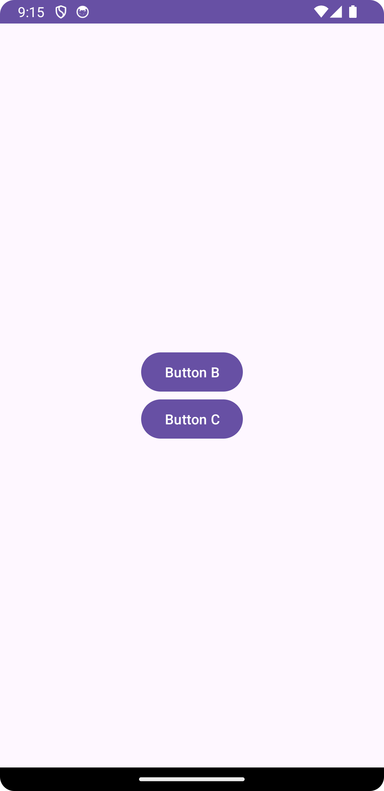
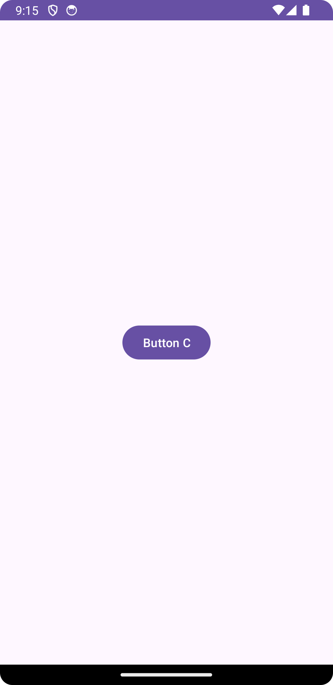
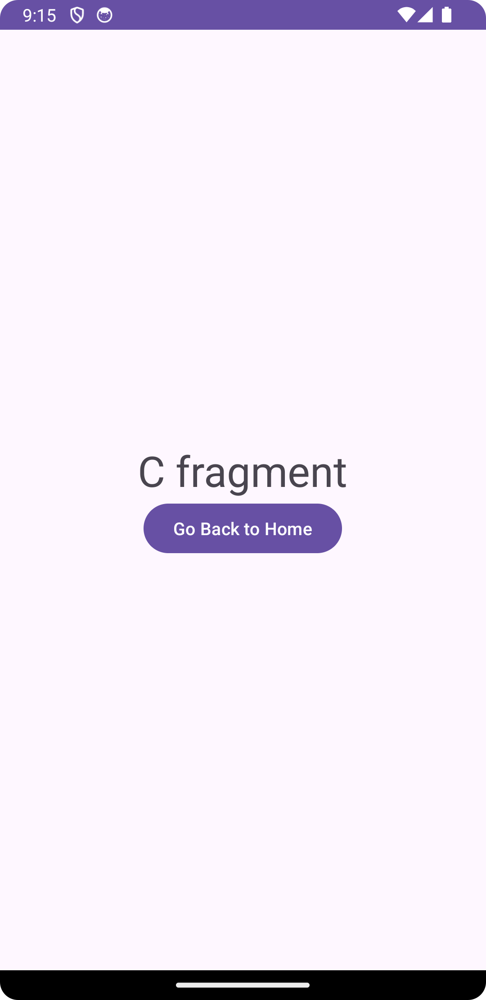

# JetpackApp

JetpackApp is an Android application showcasing navigation between multiple fragments using the Navigation Component.

## Overview

This app demonstrates the use of fragments and navigation in Android using the Navigation Component. It contains three main fragments:

- **AFragment**: Initial fragment with buttons to navigate to `BFragment` or `CFragment`.
- **BFragment**: Fragment navigable from `AFragment` and contains a button to navigate to `CFragment`.
- **CFragment**: Fragment navigable from either `AFragment` or `BFragment`.

## Fragments

### AFragment
- Description: This is the starting fragment of the app.
- Features:
    - Contains buttons to navigate to `BFragment` or `CFragment`.

### BFragment
- Description: Navigable from `AFragment`.
- Features:
    - Contains a button to navigate to `CFragment`.
      
### CFragment
- Description: Navigable from `AFragment` or `BFragment`.
- Features:
    - Details about features in CFragment.
      
## Navigation

The navigation graph (`main_graph.xml`) illustrates the flow between fragments:
- `AFragment` has actions to navigate to both `BFragment` and `CFragment`.
- `BFragment` has an action to navigate to `CFragment`.

## Setup

### Prerequisites
- Android Studio installed
- Android SDK configured

### Installation
1. Clone the repository: `git clone https://github.com/your-username/JetpackApp.git`
2. Open the project in Android Studio.
3. Build and run the project on an emulator or physical device.

## Usage

- Launch the app and observe the navigation flow between fragments.
- Interact with buttons in `AFragment` and `BFragment` to navigate between fragments.

## Contributing

Feel free to contribute by:
- Reporting issues.
- Submitting feature requests.
- Making pull requests.

